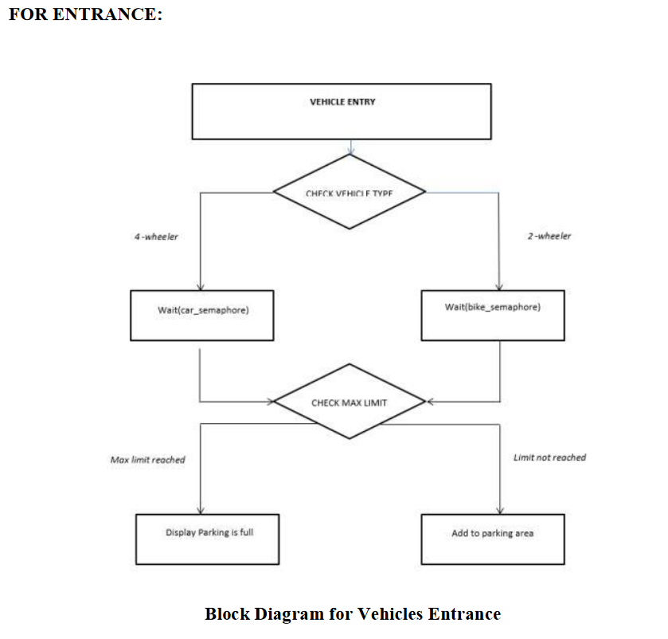
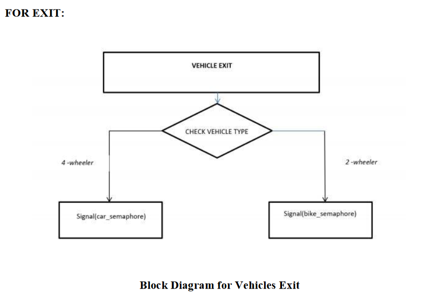
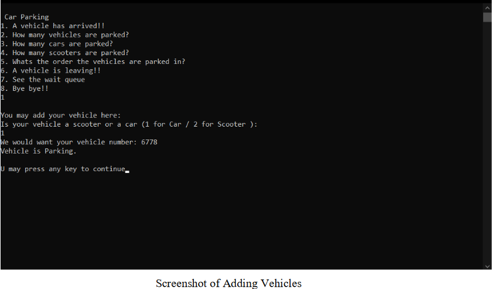
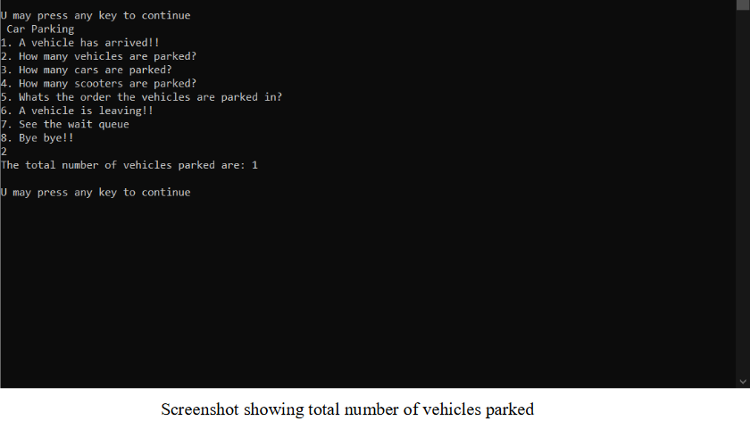
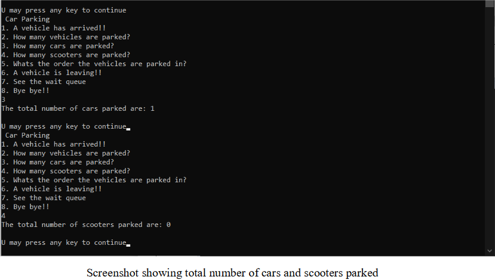
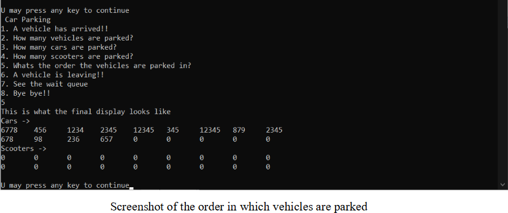
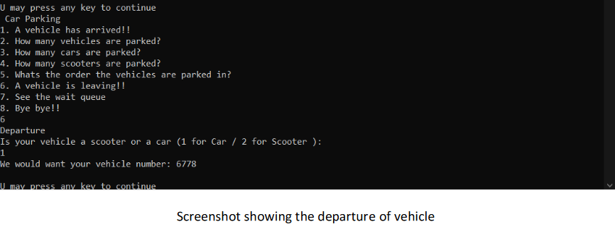
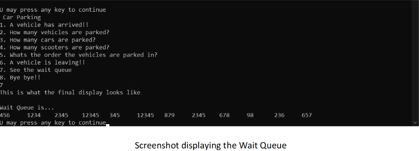

### 1.ABSTRACT
We  are aware that  finding  an automobile  parking space  in  most  metropolitan areas, especially during the      rush hours, is      extremely difficult.      This       difficulty doesn't arise because of  unavailability  of  parking  spaces,  but  due  to  unawareness  and  inefficiency  of  the  available parking spaces at that point. During this project, we design a prototype of ‘Semaphore and Slot Acquisition  based Parking  System  (SSAPS)’  that  enables  the drivers to  effectively  find  and reserve the vacant parking spaces. The status of every parking sector is monitored and evaluated using   principle   of   counting  semaphore    and    is    shown    at    the    entry    and    exit. To make it more organised we conduct this separately for 2 wheelers and 4 wheelers using first come first servemethodology.
Keywords:Automaticparkingsystem,usingsemaphore,firstcomefirstservice,cheaperand convenient.

### 2.INTRODUCTION
We will be using semaphores and FCFS: 

1.	Semaphore: A semaphore, in its most basic form, is a protected integer variable that can facilitate and restrict access to shared resources in a multi-processing environment. 
A counting semaphore is a synchronization object that is initialized with an integer value and then accessed through two operations, which are named P and V. For this project, they will be denoting wait() and signal() operations respectively. 
The types of semaphores include: 
•	Binary Semaphore: Binary semaphore is used when there is only one shared resource. As the name suggests, it represents two possible states. (0/1) 
•	Counting Semaphore: To handle more than one shared resource of the same type, counting semaphore is used. Counting semaphore will be initialized with the count(N) and it will allocate the resource as long as count becomes zero after which the requesting task will enter blocked state. These represent multiple resources. 
•	Mutex Semaphore: Mutex is very much similar to binary semaphore and takes care of priority inversion, ownership, and recursion. 
 wait() refers to P which works to decrement and signal() refers to V which works to increment. So, the function of the semaphore in our project is to ensure that the vehicles get parked in a systematic manner with one vehicle at a time while the other vehicles wait. If more than one vehicle is entered then it will cause a deadlock, which will be avoided by using semaphores. 
 
2.	FCFS Synchronization: So, to synchronize the order we are using First Come First Serve Synchronization which will ensure that the vehicles align in the queue according to the order in which they entered. 
 
Keywords: Counting semaphores, binary semaphores, automatic machine, avoid deadlock, first come first serve, align in the queue. 

### 3.EXPLANATION AND METHODOLOGY 
This project is based on the concept of semaphores and scheduling. The vehicles are scheduled to enter the parking system in two queues. Only one vehicle can enter the parking system/machine at a time. 
 
P and V Semaphores are used to avoid deadlock whenever a vehicle enters the system, function P is called which decrements the value of S (constant) to 0 and until S is equal to one no other vehicle can enter the machine and when the vehicle get parked it calls function V which increments S to 1 so now other vehicle can also enter the machine. 
So, for occupied slots, the semaphore value becomes 0 thereby preventing other users from accessing them and this is the locked stage. When it is incremented to 1, then it is unlocked and is open for other vehicles to access it. 
 
We have done this for two-wheelers and four-wheeler’s separately. Then the vehicles reach the automatic parking machines and are left in the machine to start the process of automatic parking. The machine automatically parks the vehicles. Here, the vehicles are processes and the machine is the critical section. 
 
The parking entrance of 2 rows acts as a lock. Only one process can enter the critical section/shared memory at a time in each row ,one four-wheeler and one two-wheeler. The processes(here vehicles) are then parked(scheduled) on the basis of first come first serve and semaphore. The processes then leave the shared memory and next vehicle can enter the parking area. 
 
The diagrams are given in the next section. 

### 4.PROPOSED ARCHITECTURE DIAGRAM 

### 5.RESULTS AND DISCUSSION 
It has turned into a difficult situation to find a parking spot for automobiles in metropolitan areas because of the chaos. Using semaphores and FCFS scheduling, we are hoping to solve this issue. 

Initially, the value of counting semaphore is set to the total number of slots in the parking sector. As and when a particular slot is accessed or occupied, the value of the counting semaphore decrements. In this way, user can only access the slots that are neither accessed nor occupied.

Using P and V Semaphores, P semaphore will decrease the value of S and V will increase the value of S. Every vehicle will be given priority onthe basis of first come first service. 

This way every vehicle can get a place to park

### 6.CODE
/main.cpp

### 7.OUTPUT 

### 8.CONCLUSION
We tend to fix the issue of parking slots by performing this and incorporating it into the machine/system. 
The semaphore value of the parking slots is monitored continuously to check for its transition from 1 to 0 or vice versa and the information is updated to the main server frequently. 
The following estimated experimental results illustrate the efficacy and feasibility of the proposed Semaphore and Slot Acquisition based Parking System (SSAPS) in a cost effective way. 
We have worked towards solving this parking issue and semaphore has ensured that it would work smoothly. This is such a frequent problem in today’s world and must be brought to everyone’s attention to save time and avoid any sort of chaos. 
During the peak hours, most parking lots are almost fully occupied in central area. Consequently, users have to select the parking lots in surrounding area, which are closer to their start points. Therefore, it results in the reduction of average driving distance during the peak hours. 
This project highlights the importance of synchronization and semaphores in the real world, and many more applications can be propagated by using these operating systems topics. 

